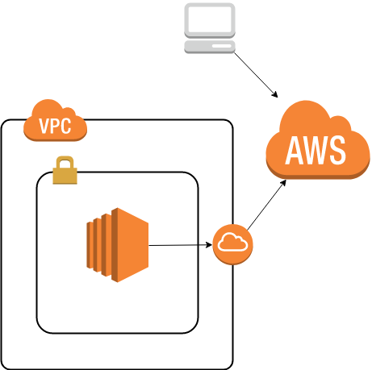
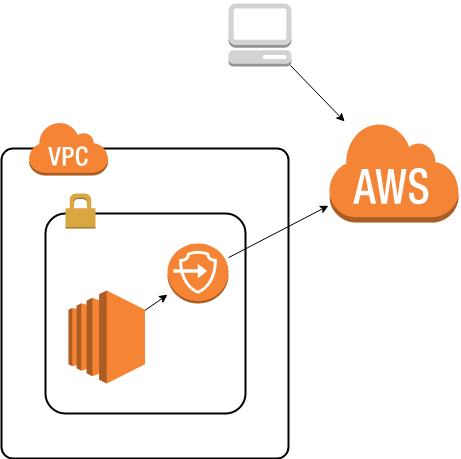

# aws-session-manager-examples

This repo containers cloudformation templates and some examples of AWS Session Manager usage

## Architecture

### Public



### Private



## Bootstrap

```console
$ python3 -m venv .
$ source bin/activate
$ pip install -r requirements.txt
[...]
```

## Deployment

```console
$ cd cfn
$ sceptre launch -y private
[...]
$ sceptre launch -y public
[...]
```

## Connect

Using `aws-cli`

`aws ssm start-session --target [instance-id]`

Using [sigil](https://github.com/danmx/sigil)

`sigil -c sigil/config.yaml ls -i`
